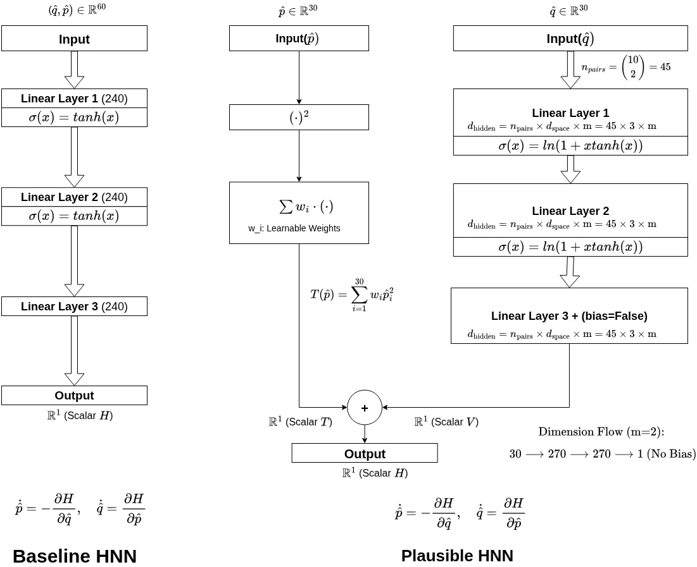
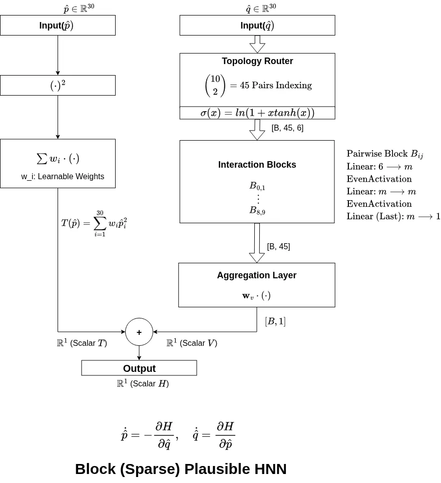
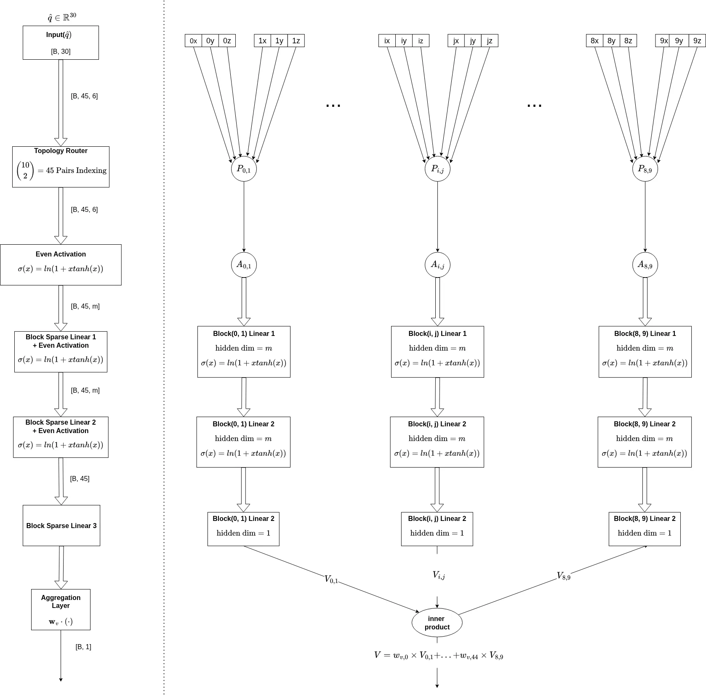
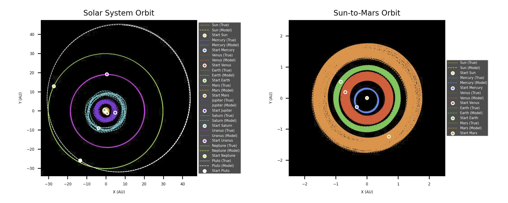
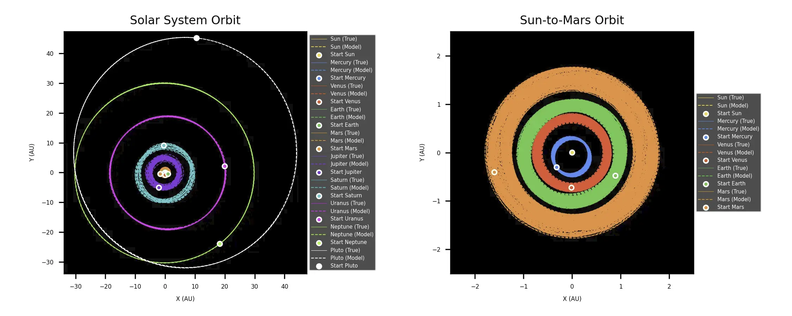

# Hamiltonian Neural Networks for Solar System Dynamics

This repository contains code and experiments for structurally constrained, physics-informed geometric deep learning models that simulate a 10-body Solar System over long astronomical timescales (up to 400 years). The work compares several Hamiltonian Neural Network (HNN) variants — baseline HNN, Plausible HNN (P-HNN), and Block (Sparse) Plausible HNN (BLK-P-HNN) — and documents the normalization, energy-decomposition, and topology-adaptor techniques developed to improve long-term stability and drastically reduce model size. Plausible HNN and Block (Sparse) Plausible HNN were developed in this work.

### Data & Checkpoint Setup
To restore the original project structure required for verification and execution, please follow these steps:

1. Download all assets from the provided [Anonymous Google Drive Storage Link](https://drive.google.com/drive/folders/1SE74fHGZ-jJVFzI5l_j1Asg8OXk47You?usp=drive_link).
2. Distribute the downloaded `.npz` and model weight files back into their respective local directories exactly as shown below:

```text
hnn-solar-system-4-submission/
├── analysis/
│   └── harvests/
│       └── [Place downloaded analysis .npz files here]
├── data_ode/
│   └── [Place downloaded raw .npz training/validation datasets here]
├── experiment_baseline-hnn/
│   └── checkpoints/
│       └── [Place downloaded baseline weight files here]
├── experiment_block-plausible-hnn_lite/
│   └── checkpoints/
│       └── [Place downloaded blk-p-hnn-lite weight files here]
├── experiment_plausible-hnn/
│   └── checkpoints/
│       └── [Place downloaded p-hnn weight files here]
└── experiment_plausible-hnn_lite/
    └── checkpoints/
        └── [Place downloaded p-hnn-lite weight files here]
```

### Data Setup
1. Download the `.npz` files from the Google Drive link.
2. Place all downloaded files directly inside the `data_ode/` directory.


## 📝 Abstract (initial manuscript draft)
This work investigates a structurally constrained, physics-informed geometric deep learning framework designed to model a 10-body configuration of the Solar System over astronomical timescales up to 400 years. Conventional Hamiltonian Neural Networks (HNNs) frequently exhibit optimization stagnation and localized numerical instabilities—typically leading to unphysical inner planet ejections within 10 to 50 years—due to the high dynamic range of physical magnitudes across celestial bodies. To address these baseline characteristics, we employ a Vector-wise Multiscale V2 normalization scheme alongside an explicit Kinetic-Potential (T-V) energy separation via the Plausible HNN (P-HNN). While dense P-HNN architectures extend the sustainable orbital lifespan up to 200 years, scaling the framework over a 4,000-year dataset to encompass Pluto's full orbital threshold (~ 248 years) introduces parameter inflation and computational bottlenecks during training. To manage this overhead, we develop the Block (Sparse) Plausible HNN (BLK-P-HNN), which incorporates a Topology Adaptor to isolate position inputs into 45 independent sub-manifolds via batch matrix multiplications. This structural sparsity compresses the model's total weight footprint 400-fold, from 88.6 MB down to 200 kB. Empirical evaluation across the 400-year integration window demonstrates a distinct cost-performance trade-off: while the dense P-HNN maintains a lower average tracking error and isotropic dispersion, the compressed BLK-P-HNN successfully maintains a gravitationally bound state for the entire 400-year duration, albeit at the expense of introducing subtle localized orbital variations and increased dispersion along the Z-axis. Ultimately, these results demonstrate that embedding domain-specific inductive biases with structural sparsity provides a viable pathway to achieve extreme parameter compression while preserving macro-scale gravitational stability in long-term multi-body celestial simulations.

## 📁 Repository overview

The codebase contains dataset preprocessing, model definitions, training and evaluation scripts, and analysis notebooks used for the experiments in the manuscript. Major folders:

- `analysis/` — some harvesting and plotting scripts used to generate figures and numerical evaluations in the draft. Many figures are produced by running per-experiment evaluation notebooks (see the `experiment_*` folders) and then post-processing those outputs.
- `commons/` — shared utilities and model definitions (HNN variants, energy utils, data loaders).
- `data_ode/` — preprocessed ODE datasets for multi-scale and uni-scale experiments.
- `experiment_*` — training and evaluation runs, notebooks and checkpoints for different model families and ablations.
- `static/` — static assets.

## 🧭 How it proceeded
The project started by evaluating baseline HNNs on a dense 10-body Solar System ODE dataset. Recurrent issues were identified: optimization stagnation and early inner-planet ejections. To mitigate these, two orthogonal modifications were developed and evaluated:

1. Vector-wise Multiscale V2 normalization to reduce dynamic range disparities across body-wise features.
2. Plausible HNN (P-HNN) — developed in this work — which enforces an explicit kinetic (T) and potential (V) energy decomposition during learning.

Scaling P-HNNs to longer timescales motivated the Plausible HNN (P-HNN) and its evolution to the Block (Sparse) Plausible HNN (BLK-P-HNN) with a topology adaptor that partitions inputs into smaller sub-manifolds, enabling a 400x reduction in parameter count while preserving large-scale gravitational binding over 400 years.

## 🔬 Experiments and findings

 - Dense P-HNN (1000-year dense dataset, dt=0.0005): lower mean tracking error and isotropic dispersion; reliably accurate where parameter budgets permit, and extends stable orbits up to ~200 years in many runs when using an 8:2 train:test split (the test segment from a 1000-year dense set corresponds to ~200 years). To evaluate horizons beyond ~200 years we generated a 4000-year "lite" dataset by synthetically integrating with a 12th-order Yoshida integrator at dt=0.0005 and downsampling by taking every 20th step (effective dt=0.01). Using this lite dataset P-HNN instances that sustain 400-year trajectories can be found, but their V-net remains dense so model size reduction is not achieved.
 - BLK-P-HNN: extreme weight compression (88.6 MB → 200 kB) achieved via block/sparse topology and the topology adaptor. BLK-P-HNN experiments reported here were run on the 4000-year lite dataset (dt=0.01) and demonstrate preserved gravitational binding for the full 400-year evaluation windows, at the cost of subtle localized orbital variations and increased dispersion along the Z-axis.

## 📄 Documentation & notebooks

See `analysis/` for harvesting and plotting scripts used to create the figures in the draft. Notable files (harvest scripts are directly tied to model outputs):

- `analysis/harvest_baseline-hnn_energies.py` — harvest energy terms and predictions for baseline HNN experiments.
- `analysis/harvest_p-hnn_part1_energies_400yrs.py` — harvest energy tracking and model outputs for P-HNN (part1).
- `analysis/harvest_blk-p-hnn_part1_energies_400yrs.py` — harvest energy tracking and model outputs for BLK-P-HNN (part1).

Processing order note: the typical pipeline is to run orbit-harvest scripts first (they produce predicted orbit npz files in `analysis/harvests/`), then run energy-harvest scripts which read those orbit harvests to compute energy decompositions and metrics. Once harvested, the outputs in `analysis/harvests/` are ready to be plotted or post-processed by the plotting scripts.

## 🏗️ Architectures

The repository includes three architecture diagrams (WEBP) under `static/` illustrating the models used in this work:


Below are inline previews (relative paths) so the images render in local previews and on GitHub:


*Figure: Baseline HNN vs Plausible HNN (T-V decomposition overview).* 


*Figure: Block (Sparse) P-HNN — high-level topology adaptor and block partitioning.*


*Figure: Detailed V-net of BLK-P-HNN internals and sub-manifold wiring (batch matrix multiplies).* 

Note: when previewing locally with `grip`, run it from the repository root so relative paths like `static/...` resolve correctly. If an image doesn't appear, try refreshing the browser or restarting `grip`.

### Representative evaluation (BLK-P-HNN on 4000-year lite dataset)

The following evaluation visualizes how the Block (Sparse) Plausible HNN (BLK-P-HNN) was tested on the 4000-year lite dataset (dt=0.01). The dataset was split with train:test = 8:2. The test segment (years 3200–4000) was further divided into two partitions:

- partition1: years 3200–3600
- partition2: years 3600–4000

For each partition we used the first point (q, p) within the partition as the neural model's initial condition and then integrated the learned ODE forward to produce a 400-year trajectory from that start. The two images below show the resulting orbit traces generated from those two partition initial points — these are intended as representative evaluation figures for long-horizon stability under the compressed BLK-P-HNN.


*Figure: BLK-P-HNN evaluation starting at partition1 initial point (3200–3600 region).* 


*Figure: BLK-P-HNN evaluation starting at partition2 initial point (3600–4000 region).* 

## 📌 How to reproduce (short)

1. Prepare data: see `data_ode/` — the repository includes pre-split .npz datasets and preprocessing scripts for dense dataset of 1000 years in dt=0.0005. The lite dataset of 4000 years in dt=0.01 is ready.
2. Train/evaluate a model: use `experiment_plausible-hnn/p-hnn-train.py`  or corresponding experiment folders for BLK-P-HNN and baseline runs. Each experiment directory contains evaluation notebooks (.ipynb) as well.
3. Recreate plots: run the scripts in `analysis/` to reproduce some of figures used in the draft.

Note: experiments using the 1000 years of dense dataset generated in dt=0.005, {q.npz, p.npz, dq.npz, dp.npz} can be computationally expensive; consider running experiments using the 4000 years of lite dataset generated in dt=0.01, {q_lite.npz, p_lite.npz, dq_lite.npz, dp_lite.npz} first.

## 🧾 License & Citation

This repository is licensed under the MIT License — see the `LICENSE` file for details.

To maintain the double-blind review process, citation details and the link to the permanent repository will be made publicly available upon acceptance of the manuscript.

## 🤝  External Codebases

The dense dataset (dt=0.0005) utilized in this work was synthetically generated using a 12th-order Yoshida symplectic integrator. The code is available at: <https://anonymous.4open.science/r/Yoshida-Symplectic-Integrator-2787>.

SLL-HNN, the satellite contribution to this work, is available at: <https://anonymous.4open.science/r/Separable-Latent-Linear-Hamiltonian-Neural-Network-303F>.

If you use this work in your research, please cite the accompanying manuscript (preprint or published DOI when available).
---

